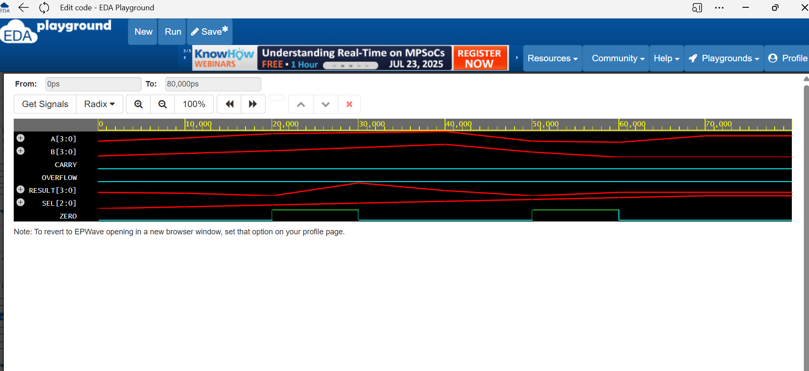

# 🔢 4-bit ALU in Verilog

This project contains the **RTL design and testbench** of a 4-bit Arithmetic Logic Unit (ALU) using **Verilog HDL**. The design was created, simulated, and verified on [EDA Playground](https://www.edaplayground.com/), and uploaded to GitHub for academic and reference purposes.

---

## 📁 Files Included

| File Name        | Description                            |
|------------------|----------------------------------------|
| `alu_4bit.v`     | Verilog code for the 4-bit ALU module  |
| `tb_alu_4bit.v`  | Testbench for simulating the ALU       |

---

## ⚙️ ALU Operations Supported

The ALU supports 8 operations based on a 3-bit `SEL` input:

| SEL  | Operation        | Description                 |
|------|------------------|-----------------------------|
| 000  | `A + B`          | Addition                    |
| 001  | `A - B`          | Subtraction                 |
| 010  | `A & B`          | Bitwise AND                 |
| 011  | `A | B`          | Bitwise OR                  |
| 100  | `A ^ B`          | Bitwise XOR                 |
| 101  | `A > B`          | Greater than (returns 1/0)  |
| 110  | `A << 1`         | Shift Left                  |
| 111  | `A >> 1`         | Shift Right                 |

---

## 🧪 Testbench Features

- Simulates multiple test cases
- Displays output using `$display`
- Dumps waveforms with `$dumpfile` and `$dumpvars`
- Suitable for running on open-source Verilog simulators like **Icarus Verilog**

---

## 🖥️ Simulation Output

Here is a snapshot of the terminal output after running the testbench:

---

## 📊 Waveform

The waveform below shows how the ALU responds to different operations:

## 🌐 EDA Playground Simulation

You can view and run the simulation online here:  
🔗 [Run on EDA Playground](https://edaplayground.com/x/9FDf)  
*(Replace this with your actual saved link)*

---

## 👩‍💻 Author

**Jahnavi Reddy Saddala**  
B.Tech Student – EEE  
Interested in Digital Design and VLSI Frontend  
📫 [jahnavireddy56@gmail.com](mailto:jahnavireddy56@gmail.com)

---

## 📄 License

This project is for educational purposes. Feel free to use, modify, and share it with credit.
